# Dummy Skill

An OpenCode skill for general-purpose investigation using parallel agents with built-in hallucination detection.

## Workflow



The orchestrator decomposes a user query into 3 independent investigation threads. Each executor investigates from a unique angle, gathers evidence, and self-verifies through an evaluator that checks for hallucinations (non-existent files, wrong line numbers, invented facts). The orchestrator compiles results, prioritizing evaluator-verified (OK) findings.

**Why three angles:**

| Angle | Purpose |
|-------|---------|
| Thread A | Direct / primary perspective |
| Thread B | Alternative / secondary perspective |
| Thread C | Edge cases / critical evaluation |

**Why an evaluator:**

Executors can hallucinate — citing files that don't exist, misquoting line contents, or inventing function names. The evaluator catches these by independently verifying each claim against the actual source. It does NOT assess logic or reasoning quality, only factual accuracy.

## Structure

```
dummy/
├── README.md
├── workflow.{yml,mmd,svg}    # Workflow config and diagram
├── SKILL.md                  # Skill definition
└── agents/
    ├── orchestrator.md       # Primary agent: decomposes query, spawns executors, compiles
    ├── executor.md           # Subagent: investigates from one angle, self-verifies
    └── evaluator.md          # Subagent: fact-checks claims, returns OK/NOK
```

## Installation

```bash
mkdir -p ~/.config/opencode/agents/dummy
cp agents/*.md ~/.config/opencode/agents/dummy/
```

## Usage

```bash
opencode run --agent dummy/orchestrator \
  "Why is the authentication failing for users with special characters in their passwords?"
```

```bash
opencode run --agent dummy/orchestrator \
  "How do I implement rate limiting in this Express app? Codebase: /path/to/project"
```

```bash
opencode run --agent dummy/orchestrator \
  "Explain how the caching layer works and identify potential issues"
```

## Agents

| Agent | Mode | Tools | Role |
|-------|------|-------|------|
| orchestrator | primary | task | Decomposes query, spawns 3 executors in parallel, compiles final report |
| executor | subagent | read, grep, glob, task, webfetch | Investigates from one angle, gathers evidence, calls evaluator |
| evaluator | subagent | read, grep, glob | Verifies executor claims against sources, returns OK/NOK |

## Workflow diagram

```
User query
    │
    ▼
┌─────────────────┐
│  Orchestrator   │
│  (interprets &  │
│   decomposes)   │
└────────┬────────┘
         │
    ┌────┼────────────────┐
    │    │                │
    ▼    ▼                ▼
┌──────┐ ┌──────┐    ┌──────┐
│Exec A│ │Exec B│    │Exec C│  ← parallel
└──┬───┘ └──┬───┘    └──┬───┘
   │        │           │
   ▼        ▼           ▼
┌──────┐ ┌──────┐    ┌──────┐
│Eval A│ │Eval B│    │Eval C│  ← each executor calls evaluator
└──┬───┘ └──┬───┘    └──┬───┘
   │        │           │
   ▼        ▼           ▼
┌─────────────────────────────┐
│       Orchestrator          │
│   (compiles OK/NOK results) │
└─────────────┬───────────────┘
              │
              ▼
        Final report
```

## Tips for Best Results

**Do:**
- Provide as much context as possible (file paths, component names, error messages)
- Be specific about what you want to know — vague queries produce vague results
- Mention the domain or technology stack when relevant

**Avoid:**
- Extremely simple queries (yes/no questions) — this workflow adds overhead
- Queries with no verifiable sources — the evaluator can't check pure opinions
- Expecting the evaluator to assess reasoning quality — it only checks facts

## Design Notes

**Why parallel executors:** Different angles catch different aspects of a problem. A single agent might miss edge cases or alternative interpretations.

**Why self-verification:** Each executor calls the evaluator independently. This means:
- Verification happens close to the source (the executor provides full context)
- Failed evaluations don't block other executors
- The orchestrator sees which threads are trustworthy before compiling

**Why simple OK/NOK:** The evaluator doesn't assess whether the reasoning is correct or the solution is optimal — only whether the cited facts actually exist. This keeps verification fast and unambiguous.
